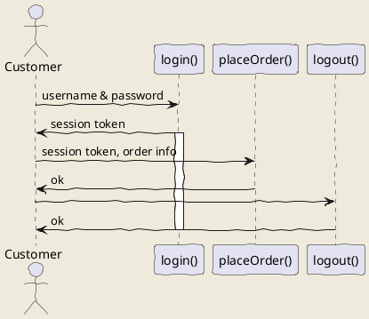

# Micromouse Sim
## Project Structure
| Directory / File | Description |
|-----------|-------------|
|Readme.md| This file.|
|Jenkinsfile| File used to program CI/CD tool to automatically test the app.|
|.gitignore| File used to tell git what files/directory to ignore.|
| /app | The app is the directory containing all the source-code relevant to the project|
| /app/src | The src is the directory containing the source-code of the application. |
| /app/test | The test is the directory containing the unit test of the application. |
| /playground |The playground is the directory used to create test scripts to try out concepts and prototypes. |

## Code Structure
| Package | Description |
|---------|-------------|
| Simulators | Contains the different types of simulators. |
| Evaluators | Contains the different types of Evaluators to evaluate a mice performance. |
| Mice       | Contains the different types of default mice that can be compared to. |
| Maze       | Contains the different types of maze generators to generate different types of mazes. |
| Cells      | Contains the different types of cells that can be used to build the mazes. |
| Tools      | Contains the different tools that can be used in the development. |
| Test       | Contains the different test to test the different classes. |

# Test
## uml: sequence diagram
Here I will embed PlantUML markup to generate a sequence diagram.

I can include as many plantuml segments as I want in my Markdown, and the diagrams can be of any type supported by PlantUML.

