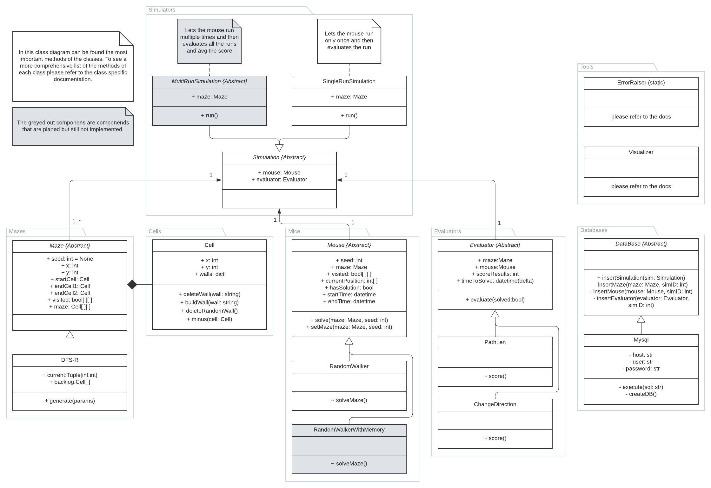

# Micromouse Sim
The Micromouse Sim or short MMs, is a library intended to help in the development of the software of so called micro mouses. The source code can be found at the following github repository: [https://github.com/LorenzoLeva/MicromouseSim](https://github.com/LorenzoLeva/MicromouseSim)

## What is a Micromouse?
Micromouse is an event where small robot mice solve a 16×16 maze which began in the late 1970s. Events are held worldwide and are most popular in the UK, U.S., Japan, Singapore, India, and South Korea.
The maze comprises a 16×16 grid of cells, each 180 mm square with walls 50 mm high. The mice are entirely autonomous robots that must find their way from a predetermined starting position to the central area of the maze unaided. Therefore, the mouse needs to keep memory to map out the labyrinth. In addition, it has to detect when it has reached the goal. After reaching the goal, the mouse can still perform an additional search to find an optimal route. Once the optimal path has been found, the mouse will run that route in the shortest possible time. 

Exp.: [https://www.youtube.com/watch?v=NqdZ9wbXt8k?t=17](https://www.youtube.com/watch?v=NqdZ9wbXt8k?t=17)

## The Simulator
The Micromouse simulator is a tool that allows testing and optimizing the search algorithms for such mice. The simulator is modular, allowing for complete customization from different Mazes to different evaluation functions. The following diagram depicts the different use cases of this library.


Lets now see how to evaluate a mouse and see how the library works behind the scenes. The folowing section explains the procedure, for a hands on example please refer to the `example.ipynb` notebook.


When we call `Simulator.run()` the simulator starts by trigering the Mouse to solve the maze. Firsty the Mouse sets up the maze. Once it recieved the maze properties it starts to solve the maze. Once it reached an end position it returns the path it found as solution to the Evaluator of the Simulator which will return the score of the simulation to the Simulator.
## The Requirements
The following is a list of requirements the tool fulfills or will fulfill:
* [x] The App shall generate a random Maze.
* [x] The App shall simulate the Mice.
* [x] The App shall evaluate the Mice in the Maze.
* [x] The App shall keep track of all relevant simulation metrics and store them in a DataBase:
  * [x] Metadata of environment and mice to allow for the replication of the simulation
  * [x] Experiment data for debugging
  * [x] Results to analyze the performance
* [x] Visualization shall be generated

Nice to have:
* [ ] Multiple Simulator types 
  * [x] SingleRunSimulator
  * [ ] ComparisonSimulator
  * [ ] MultiRunSimulator (Same maze and different mazes)
    * [ ] AverageScoreSimulator
    * [ ] WeightedAverageScoreSimulator
    * [ ] BestScoreSimulator
    * [ ] WorstScoreSimulator
* [ ] Multiple Maze generators with different rules
* [ ] Multiple Mice with a variety of search algorithms
  * [ ] RandomWalkerWithMemory
  * [ ] Mice with post solution procecing (Mice that after having complete the first run calculates a best path with the memory gained.)
    * [ ] GraphMice
* [X] Multiple evaluation function
  * [x] shortest path
  * [x] direction change
  * [ ] min inertia

## Architecture
The library is written in python to not only allow the developer to run simulation quickly and easily in notebook tools like JupyterLab from any device but also to allow the use of Machine Learning frameworks like Tensorflow and PyTorch.

### Packages
The following diagram describes the package structure of the library.


| Package | Description |
|---------|-------------|
| Simulators | Contains the different types of simulators. |
| Evaluators | Contains the different types of Evaluators to evaluate a mice performance. |
| Mice       | Contains the different types of default mice. |
| Maze       | Contains the different types of maze generators. |
| Cells      | Contains the different types of cells that can be used to build the mazes. |
| Tools      | Contains the different tools that can be used in the development. |
| DataBases  | Contains the different connectors to the different supported DataBases. |
| Test       | Contains the different test of the classes. |

### Classes
The following diagram describes the classes of the packages of the library and how they relate to each other.



| Class | Description |
|-------|-------------|
| *Simulator* | All the children of the Simulator abstract class can be used to run the simulations and evaluate the Mice. It receives as an input the instance of the mouse which has to be evaluated, the type of maze in which the mouse has to be evaluated in, and the type of the evaluator that is going to be used to evaluate the mouse. (This class is an implementation of an abstract factory design pattern. Instead of using the original patter it was decided to pass directly the constructor of the classes instead of a build function that returns an instance of the class to simplify the implementation of custom variants of the Evaluator and Maze classes. This class is also an implementation of a Strategy design pattern.)|
| SingleRunSimulation | The SingleRunSimulation is a child of the Simulator class and is used to run simulations where the mouse dose only one run of the maze and then is evaluated. |
| *MultiRunSimulation* | All the children of the MultiRunSimulation abstract class can be used to run multiple simulations and evaluate the Mice. |
| *Maze* | All the children of the Maze abstract class can be used to generate a maze in which then a mouse can be evaluated. (This class is an implementation of a Strategy design pattern.)|
| DFS_R | The DFS_R class is a child of the Maze class and generates a maze with the "Depth first search (Recursive implementation)" method. For more information about this method please refer to the wikipedia page [Here](https://en.wikipedia.org/wiki/Maze_generation_algorithm#Recursive_implementation) |
| Cell | The Cell class is a class that describes the single cells of an maze. |
| *Mouse* | All the children of the Mouse abstract class can be used to implement the search algorithms to solve the mazes. These are the algorithms to be evaluated. |
| RandomWalker | The RandomWalker class is a child of the Mouse class and is the most naive algorithm to solve a maze. It has no memory and choses its next step completely randomly. Its a good baseline to compare against. |
| RandomWalkerWithMemory | The RandomWalkerWithMemory class is a child of the Mouse class. It has a memory of where it was and the not taken paths and choses its next step randomly from the paths where it wasn't. Its a good baseline to compare against. |
| *Evaluator* | All the children of the Evaluator abstract class implement a way to evaluate the mice in the simulations. (This class is an implementation of a Strategy design pattern.)|
| PathLen | The PathLen class is a child of the Evaluator class and evaluates the mice by calculating the length of the path of the solution the mice find. |
| ChangeDirection | The ChangeDirection class is a child of the Evaluator class and evaluates the mice by calculating the times the mouse changes its direction in its solution. |
| *DataBase* | All the children of the DataBase abstract class are used to store the simulation data and their results into a DataBase. |
| Mysql | The Mysql class is a child of the DataBase class and store the simulation data and their results into a Mysql DataBase. |
| ErrorRaiser | The ErrorRaiser class implements multiple methods to check certain things (exp.: type of var) and raises errors accordingly. |
| Visualizer | The Visualizer class is used to visualize different component like a maze. |

For a more detailed information about the different implemented classes and their methods please refer to the [Documentation](#documentation).

## Testing
All the tests of the code can be found in the `/app/src/Test` directory. The tests are grouped by type. All the code that is found in the master branch of the repository was tested and passed 100% of the test in the `/app/src/Test` directory. For a full description of every test please refer to the [Documentation](#documentation).
### Unit Test
The unit tests of the code can be found in the `/app/src/Test/UnitTest` directory and are implemented with the native `unittest` python library . All tests have the following naming convention `[ClassName]_test.py` and cover following classes:

| Class | Package |
|-------|---------|
| Cell  | Cell |
| Maze | Maze |
| Mouse | Mouse |
| ErrorRaiser | Tools |

To execute the Unit Tests cd into `/app/src` and execute `python -m unittest discover -s "./Tests/UnitTest/" -p '*_test.py'` in the terminal.


## Documentation
The full documentation can be found in the `./app/docs/sphinx_doc/_build/html` and can be viewed in every browser by opening the [index.html](app/docs/sphinx_doc/_build/html/index.html) file. The folowing comand can be used to open the docs from the terminal `open app/docs/sphinx_doc/_build/html/index.html`

### Documentation convention
In this project we use the Google documentation Style. Here an [Example](https://sphinxcontrib-napoleon.readthedocs.io/en/latest/example_google.html).

### Autogenerate of Docs
In this project the documentation is automatically generated with [sphinx](https://www.sphinx-doc.org/en/master/). [Here](https://www.youtube.com/watch?v=b4iFyrLQQh4) a useful tutorial on how to generate the html documentation.

Here some useful commands:
``` Bash
cd app/docs/sphinx_doc # this changes the dir to sphinx_doc
sphinx-apidoc -o . ../../src # generates the rst
make html # generates the html files in app/docs/sphinx_doc/_build
```
The rst files define the layout of the documentation pages. For more information please refer to the sphinx [documentation](https://www.sphinx-doc.org/en/master/usage/restructuredtext/basics.html).